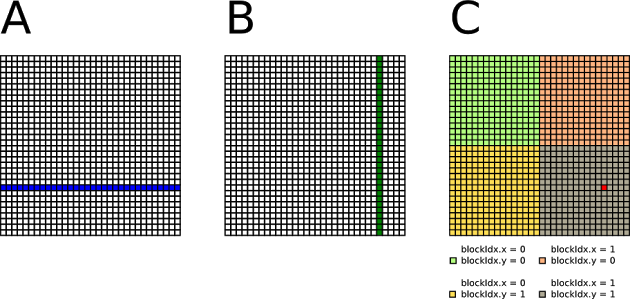
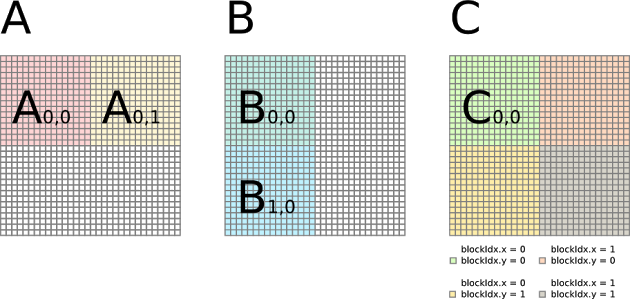
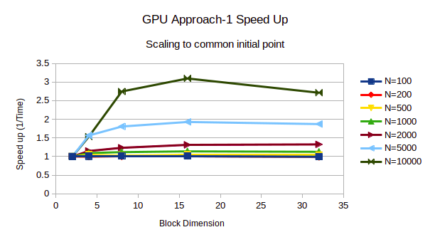
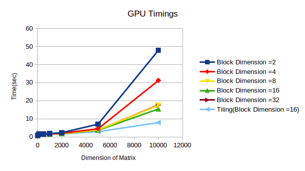

# GPU-Matrix-Multiplication
 
## Computing C = A×B on GPU

5th May 2021

## OVERVIEW
Creating two matrices, A and B, each of size (N ×N). Initialising the matrices to random floating point numbers. Writing an CUDA code for computing C = A×B. Reportingthe times taken for the codes by varying  the size of the problem from N = 100... 10000.

## Approach-1

```

A naive implementation on GPUs which assigns one threadto compute multiplication elements of
resultant matrix. Here, each thread loads one rowof matrix A and one column of matrix B from
global memory, does the inner product, and storesthe result back to matrix C in the global
memory as shown in figure-1*.

```

 

```
*Reference: http://www.es.ele.tue.nl/~mwijtvliet/5KK73/?page=mmcuda
```

## Algorithm

```
 ● Allocate dynamic memory using malloc() with the size(N × N ×size of float) for A (mat1) , B
 (mat2) and C (mul) for both CPU and GPU i.e. defineA_cpu, B_cpu, C_cpu in the CPU
 memory and A_gpu, B_gpu, C_gpu in the GPU memory
 ● Initialize random floating numbers to A_cpu and B_cpu.Copy the memory from CPU to
 GPU i.e. A_cpu to A_gpu and B_cpu to B_gpu.
 ● Define block size and grid dimension where 16 rowsconsists of one Block dimension or
 Block sIze and the grid dimension is N/Block dimension.
 ● Now, the GPU kernel is defined such that each threadloads one row of matrix A and one
 column of matrix B and does the inner product.
 ● Store the result back to matrix C i.e. C_gpu to C_cpu

```
 
## Approach-2 : Tiling*

```

Considering an example of 32 x 32 matrix multiplicationas shown in figure-2* where a 32 x 32
 matrix divided into four 16 x 16 tiles. Lets spawnfour thread blocks each for one tile computation.
 Here, each thread block will spawn threads equal tothe number of elements in each row/column
 to compute the inner product. Thus, four thread blockseach with 16 x 16 threads will be created.
 One thread block loads one tile of A and one tileof B from cpu memory to gpu memory, performs
 computation, and stores temporal result of C in register.After all the iteration is done, the thread
 block stores one tile of C into cpu memory.
 For example, a thread block can compute C0,0 in twoiterations: C0,0 = A0,0 B0,0 + A0,1 B1,0.
 In the tiled implementation, the amount of computationtime would be less as compared to the
 nominal approach.


```
 

```
*Reference: http://www.es.ele.tue.nl/~mwijtvliet/5KK73/?page=mmcuda
```


## Algorithm

```
 ● Allocate dynamic memory using malloc() with the size(N × N ×size of float) for A (mat1) , B
 (mat2) and C (mul) for both CPU and GPU i.e. defineA_cpu, B_cpu, C_cpu in the CPU
 memory and A_gpu, B_gpu, C_gpu in the GPU memory
 ● Initialize random floating numbers to A_cpu and B_cpu.Copy the memory from CPU to
 GPU i.e. A_cpu to A_gpu and B_cpu to B_gpu.
 ● Define block size and grid dimension where 16 rowsconsists of one Block dimension or
 Block sIze and grid dimension is N/Block dimension.
 ● Define shared memory A_tile and B_tile with tile sizeequal to Block dimension i.e.e 16 in
 our case.
 ● Accumulate C “tile by tile” by loading one tile ofA and one tile of B into shared memory
 such that corner cases are taken care of by checkingif N is exactly divisible by Block
 Dimension (i.e. 16).
 ● Thus, accumulating one tile of C from tiles of A andB in shared memory.
 ● Store the result back to matrix C i.e. C_gpu to C_cpu

```

 
 

## Conclusions

```
 ● As the dimension of matrices increases, the speedupincreases as shown in figure 3. Also,
 the parallelisation overheads can be observed forN<500 since there isn’t significant
 speedup observed.
 ● As anticipated, tiling optimization takes less timeto compute than approach-1 as shown in
 figure-4.
 ● Time to compute increases for Block Dimension =32than Block Dimension =16 because
 of the limit on maximum number of threads per blocki.e. 1024. After the limit is reached,
 multiple parallel operations are serialised.

```
 
## CPU and GPU Info

```
#### ////////////////////////////////////////////////////////////////

#### NVIDIA-SMI 435.21 [GeForce GTX 1080 Ti] DriverVersion: 435.21 CUDA Version: 10.

#### NVIDIA Corporation GP102 [GeForce GTX 1080 Ti] (reva1)

#### GPU Engine Specs

#### CUDA Cores

#### Graphics Clock (MHz) 1480

#### Processor Clock (MHz) 1582

#### Graphics Performance high-

#### Memory Specs

#### Standard Memory Config 11 GB GDDR5X

#### Memory Interface Width 352-bit

#### Memory Bandwidth (GB/sec) 11 Gbps

#### ////////////////////////////////////////////////////////////////

#### CPU Info:

#### No. of processors : 16

#### vendor_id : GenuineIntel

#### model name : Intel(R) Xeon(R) CPU E5-2620 v4 @ 2.10GHz

#### OS: Ubuntu 20

#### ////////////////////////////////////////////////////////////////

#### N--> Dimension of matrices

#### ----------------------------------------------------------------------------

#### To run code for Approach-1 Matrix Multiplication onGPU

#### ----------------------------------------------------------------------------

#### Simply run $ sudo ./HW3a.sh

#### for logic correctness and timing analysis

#### ------------------------------------or--------------------------------------

#### Compile: $ nvcc HW_3a.cu -o normal_GPU.o

#### Output: $ time ./normal_GPU.o <N>

#### Example:

#### $ nvcc HW_3a.cu -o normal_GPU.o

#### $ time ./normal_GPU.o 500

#### ----------------------------------------------------------------------------

#### To run code for Approach-2 Tiling optimised Mat Mulon GPU

#### ----------------------------------------------------------------------------

#### Simply run $ sudo ./HW3b.sh

#### for logic correctness and timing analysis

#### ------------------------------------or--------------------------------------

#### Compile: $ nvcc HW_3b.cu -o tiling_GPU.o

#### Output: $ time ./tiling_GPU.o <N>

#### Example:

#### $ nvcc HW_3a.cu -o tiling_GPU.o

#### $ time ./tiling_GPU.o 1000


```
 
